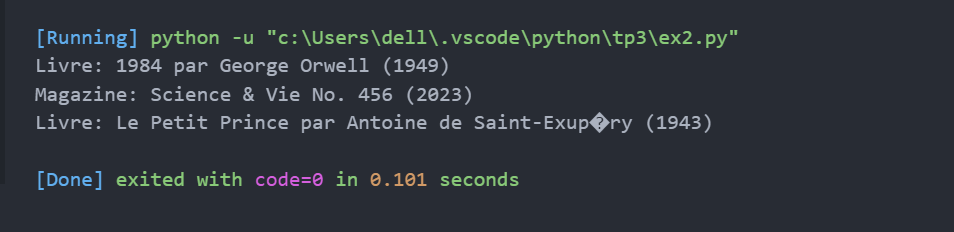

# TP3 : Héritage en Python

## Exercice 1 : Employés
Créer les classes :
- Employe : nom, salaire_base
- Manager : hérite de Employe + prime
- Developpeur : hérite de Employe + technologie (bonus)

Afficher le salaire total pour chaque employé.

### 📸 Capture d’écran de l’exécution :

---

## Exercice 2 : Bibliothèque
Créer les classes :
- Document : titre, année
- Livre : hérite de Document + auteur
- Magazine : hérite de Document + numéro

Afficher les informations des documents.

### 📸 Capture d’écran de l’exécution :

